# SU-PBL GWAS Pipeline — Presentation Flowchart

```mermaid
flowchart TD
    classDef auto fill:#e0f3ff,stroke:#0070c0,color:#003862,stroke-width:1.5px;
    classDef manual fill:#fff4d6,stroke:#e69138,color:#663c00,stroke-width:1.5px;
    classDef optional fill:#f0e5ff,stroke:#6b4fa6,color:#2f1d65,stroke-width:1.5px,stroke-dasharray:6 3;
    classDef emphasis fill:#ffe7eb,stroke:#c9002b,color:#6b0015,stroke-width:1.5px;
    classDef finish fill:#d9ead3,stroke:#38761d,color:#0b2704,stroke-width:1.5px;

    subgraph Legend [Legend]
        L1["Automated step"]:::auto --> L2["Manual step"]:::manual
        L3["Optional branch"]:::optional --> L4["Review / decision"]:::emphasis
        L4 --> L5["Wrap-up"]:::finish
    end

    A["Start<br/>Workspace Setup<br/><span style='font-size:0.78em'><div style='font-weight:bold;margin-top:4px;'>Focus</div>Prepare environment &amp; verify dependencies.<div style='margin-top:6px;'><div>✔ Create &amp; activate .venv</div><div>✔ Install Python requirements</div><div>✔ Confirm PLINK &amp; Rscript availability</div><div>✔ Run helper_self_check.py</div></div></span>"]:::auto -->|Prerequisites ready| B

    B["Stage 1 · QC &amp; Formatting<br/><span style='font-size:0.78em'><div style='font-weight:bold;margin-top:4px;'>Inputs</div>raw genotypes CSV · probe annotation Excel · cleaned map<br/><div style='font-weight:bold;margin-top:6px;'>Steps</div>• Filter SNPs (MAF &amp; missingness)<br/>• Keep mapped probes<br/>• Remove high-missing individuals<br/>• Transpose to samples × SNPs<br/>• Compute IBS similarity matrix<br/><div style='font-weight:bold;margin-top:6px;'>Outputs</div>filtered_genotypes_strict.csv · similarity_matrix.csv (outputs/step05)</span>"]:::auto --> C

    C["Stage 2 · Distance &amp; PLINK Prep<br/><span style='font-size:0.78em'><div style='font-weight:bold;margin-top:4px;'>Inputs</div>strict genotypes · similarity matrix · cleaned map<br/><div style='font-weight:bold;margin-top:6px;'>Steps</div>• Convert IBS → dissimilarity<br/>• Save genotype labels<br/>• Build PLINK .map<br/>• Write TPED/TFAM (0129 → alleles)<br/>• Run PLINK --r2 + R LD plot<br/><div style='font-weight:bold;margin-top:6px;'>Outputs</div>dissimilarity_matrix.csv · genotype_labels.txt · filtered_genotypes_strict.tped/.tfam · LD summaries &amp; plot (outputs/step10)</span>"]:::auto --> D

    D["Stage 3 · Pruning &amp; Derived Datasets<br/><span style='font-size:0.78em'><div style='font-weight:bold;margin-top:4px;'>Inputs</div>TPED/TFAM · PLINK map · filtered genotypes<br/><div style='font-weight:bold;margin-top:6px;'>Steps</div>• Run PLINK helper (indep-pairwise, make-bed, recode)<br/>• Extract LD-pruned subset (CSV)<br/>• Perform PCoA via R<br/>• Export STRUCTURE diploid file<br/>• Fix TASSEL-ready PED format<br/><div style='font-weight:bold;margin-top:6px;'>Outputs</div>pruned_panel.{bed,bim,fam,ped,map} · pruned_panel.prune.in · ld_pruned_genotypes_strict.csv · PCoA coordinates/plots (baseline `outputs/step13_pcoa/coordinates.csv`, pruned reruns `pcoa_coordinates_pruned.csv`) · ld_pruned_genotypes_structure.txt · pruned_panel_fixed.ped</span>"]:::manual --> E
    D --> F

    E["Stage 4 · STRUCTURE Analysis<br/><span style='font-size:0.78em'><div style='font-weight:bold;margin-top:4px;'>Inputs</div>ld_pruned_genotypes_structure.txt · pruned_panel.map · STRUCTURE config<br/><div style='font-weight:bold;margin-top:6px;'>Steps</div>• Run STRUCTURE (K = 1…10, ≥10 reps)<br/>• Summarise with structureHarvester (Evanno ΔK)<br/>• Align clusters via CLUMPAK<br/>• Document findings<br/><div style='font-weight:bold;margin-top:6px;'>Outputs</div>outputs/structure/runs/ · structure_harvester/{input,output} · clumpak/ exports · STRUCTURE notes</span>"]:::optional -.-> H

    F["Stage 5 · TASSEL GWAS (GUI)<br/><span style='font-size:0.78em'><div style='font-weight:bold;margin-top:4px;'>Inputs</div>pruned_panel_fixed.ped · pruned_panel.map · TASSEL-formatted phenotypes<br/><div style='font-weight:bold;margin-top:6px;'>Steps</div>• Export diagnostics (MAF, PCs, kinship)<br/>• Join phenotypes &amp; covariates<br/>• Run MLM/GLM (Bonferroni reference)<br/>• Generate Manhattan &amp; QQ plots<br/>• Log TASSEL settings<br/><div style='font-weight:bold;margin-top:6px;'>Outputs</div>outputs/tassel/diagnostics/ · outputs/tassel/mlm_stats.txt · outputs/tassel/plots/ · outputs/tassel/_README.txt</span>"]:::manual --> G

    G["Stage 6 · Post-GWAS Automation<br/><span style='font-size:0.78em'><div style='font-weight:bold;margin-top:4px;'>Inputs</div>outputs/tassel/mlm_stats.txt<br/><div style='font-weight:bold;margin-top:6px;'>Steps</div>• Split statistics by trait (R)<br/>• Apply Bonferroni &amp; FDR adjustments<br/>• Produce per-trait top lists<br/>• Compile summary tables<br/><div style='font-weight:bold;margin-top:6px;'>Outputs</div>outputs/step16_trait_split/traits/ · outputs/step17_trait_adjust/traits/ · significant_snps_all_traits.csv · adjusted trait tables</span>"]:::auto --> H

    H["Candidate Gene Review &amp; Reporting<br/><span style='font-size:0.78em'><div style='font-weight:bold;margin-top:4px;'>Inputs</div>adjusted trait tables · TASSEL plots &amp; diagnostics · probe map metadata · literature evidence<br/><div style='font-weight:bold;margin-top:6px;'>Steps</div>• Merge positional context<br/>• Cross-reference candidate genes<br/>• Update candidate_genes.xlsx<br/>• Prioritise validation experiments<br/><div style='font-weight:bold;margin-top:6px;'>Outputs</div>curated candidate list · presentation material · follow-up actions</span>"]:::emphasis --> I

    I["Finish &amp; Archive<br/><span style='font-size:0.78em'><div style='font-weight:bold;margin-top:4px;'>Inputs</div>final artefacts &amp; notes<br/><div style='font-weight:bold;margin-top:6px;'>Steps</div>• Check outputs vs checklist<br/>• Archive run logs<br/>• Document key decisions<br/><div style='font-weight:bold;margin-top:6px;'>Outputs</div>archived run history · documented analysis summary · shared deliverables</span>"]:::finish
```

> **Tip for presentations:** Highlight manual decision points (Stage 3 helper, Stage 4 STRUCTURE, Stage 5 TASSEL) in a contrasting colour, or walk the audience through one branch (e.g., TASSEL only) before mentioning optional STRUCTURE analysis.
